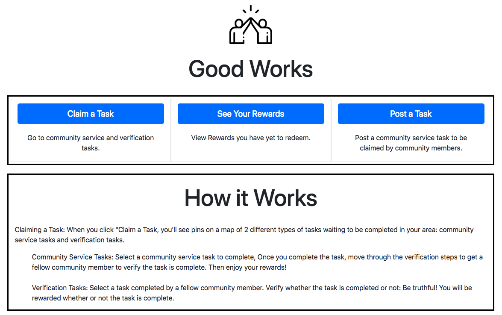

# GoodWorks 1.0.0

1st Place Winner of SpotX Sustaining our Communities Hackathon 2018. A place to post crowd-sourced community service tasks. Complete the task to get rewards from local businesses. This version was built in 5 hours by Team 6.

## Built With

* Javascript
* Google Maps JS API
* Bootstrap
* Node.js
* AWS Lambda
* AWS DynamoDB
* Serverless 

## Authors

* **Tori Mitchell**
* **Ethan Weeks**
* **Tyler Oreskey**

## Acknowledgments

* Spot X Women for sponsoring the Sustaining Our Communities Hackathon

